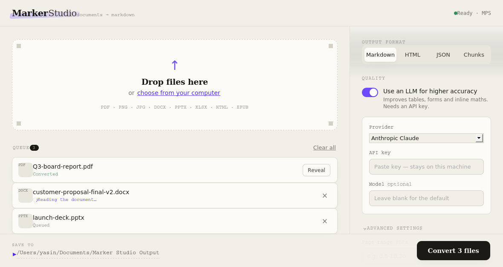

# Marker Studio

A simple, desktop GUI app for [Marker](https://github.com/datalab-to/marker) — the document-to-Markdown converter. No command line. Drop in your files, pick where to save, hit **Convert**.

Marker is excellent but lives entirely on the command line. Marker Studio wraps it in a clean interface so anyone can use it: drag in one file or fifty, choose an output folder, adjust any setting through toggles instead of flags.



---

## What it converts

PDF · PNG · JPG · GIF · WEBP · TIFF · BMP · **DOCX** · **PPTX** · **XLSX** · **HTML** · **EPUB**

Each file becomes Markdown (or HTML / JSON / chunked JSON), with images, tables and equations pulled out. Output for every file lands in its own subfolder inside the folder you choose.

---

## Running it

You don't type any commands. You double-click a launcher and the app opens in your browser.

| Your computer | Double-click this |
|---|---|
| **macOS** | `Marker Studio.command` |
| **Windows** | `Marker Studio.bat` |
| **Linux** | `marker-studio.sh` |

**The honest bit about the first launch.** Marker runs on PyTorch and AI OCR models. That's a few gigabytes that can't be shipped inside a small file. So the *first* time you open Marker Studio it sets itself up automatically — it builds an isolated environment and installs Marker. This takes several minutes and needs an internet connection. You don't do anything except wait. Every launch after that opens instantly. The AI models themselves download the first time you actually convert something.

The only requirement is **Python 3.10 or newer**. Most Macs and Linux machines have it. On Windows, if the launcher tells you Python is missing, install it from [python.org](https://www.python.org/downloads/) and tick *"Add Python to PATH"* during setup.

### macOS: "unidentified developer"

Because this isn't from the App Store, macOS may block the first open. Right-click `Marker Studio.command` → **Open** → **Open**. You only do this once.

---

## The settings

Everything Marker can do is here, with sensible defaults so you can ignore all of it and just convert.

**Output format** — Markdown (default), HTML, JSON, or Chunks (JSON split into sections, handy for RAG/LLM pipelines).

**Use an LLM for higher accuracy** — sends pages to Gemini, Claude, OpenAI, or a local Ollama model to clean up tables, forms and inline maths. You paste your own API key; it stays on your machine and is used only for that conversion. Off by default.

**Advanced**
- **Page range** — convert only some PDF pages, e.g. `0,5-10,20`.
- **Force OCR on every page** — fixes garbled or copy-protected text. Slower.
- **Strip existing OCR, then re-read** — throws away the document's own OCR layer and redoes it.
- **Mark page breaks in output** — keeps page boundaries in the result.
- **Skip image extraction** — text only.
- **Don't convert maths to LaTeX** — leave equations as plain text.

---

## Where files go

You pick the output folder at the bottom of the window (it defaults to a *Marker Studio Output* folder in your home directory). Each converted file gets its own subfolder:

```
Your chosen folder/
  report/
    report.md
    report_meta.json
    _page_0_Figure_1.jpeg
  slides/
    slides.md
    ...
```

Click **Reveal** next to any finished file to open its folder.

---

## Shipping it to people without Python (optional, advanced)

If you want to hand this to non-technical users as a true standalone `.app` or `.exe`, there's a build script under `packaging/`. Run the app once normally (so the environment exists), then:

```bash
.venv/bin/python packaging/build_standalone.py        # macOS / Linux
.venv\Scripts\python packaging\build_standalone.py     # Windows
```

This produces a large bundle in `dist/` and must be built on each OS you target. For everyone else, the normal launcher is the better route.

---

## How it's built

- **`server/app.py`** — a small FastAPI backend. It loads Marker's models once at startup and converts files one at a time on a background worker, so it never fights itself for memory.
- **`web/`** — the interface (plain HTML/CSS/JS, no build step).
- **`bootstrap.py`** — the launcher brain: makes the environment, installs Marker, starts the server, opens your browser.

The actual conversion mirrors Marker's own `convert_single` exactly, so results match the CLI.

---

## Troubleshooting

**Garbled text in the output** — turn on *Force OCR*.
**Tables or forms look rough** — turn on *Use an LLM* and add a key.
**The browser tab didn't open** — go to `http://127.0.0.1:8765` manually.
**Setup failed** — almost always a network drop. Reconnect and relaunch; it resumes where it left off.

---

## Credits & licence

Built on [Marker](https://github.com/datalab-to/marker) by Datalab / Vik Paruchuri. Marker is licensed GPL-3.0-or-later, and because Marker Studio uses it directly, Marker Studio is released under the **same GPL-3.0-or-later licence**. See `LICENSE`.

Marker's models have their own licence with commercial-use conditions — check the [Marker repo](https://github.com/datalab-to/marker#commercial-usage) before using output commercially at scale.
